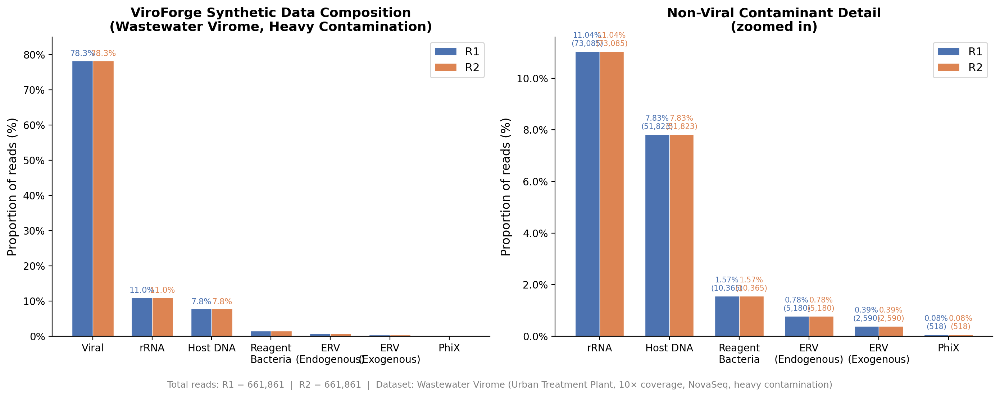
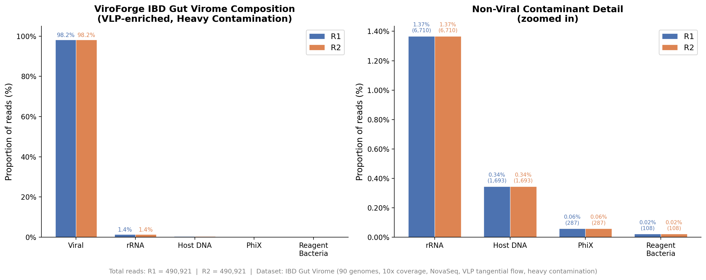
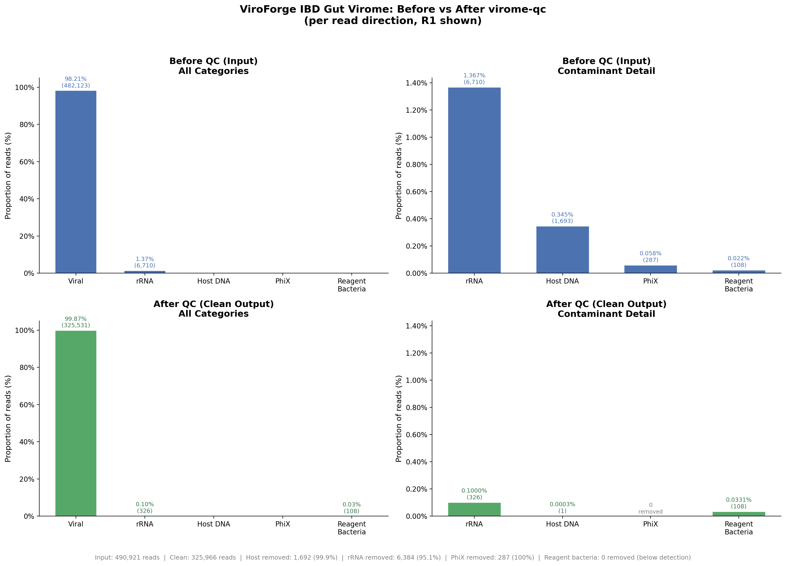

# ViroForge Ground Truth Validation Report

## virome-qc Contamination Removal Performance

**Date**: 2026-05-18
**virome-qc version**: 0.1.0
**ViroForge version**: 0.12.0
**Profile**: stool-vlp-tagmentation
**Seed**: 42 (all datasets)

---

## 1. Overview

This report evaluates virome-qc's contamination removal performance using ViroForge synthetic datasets with ground truth labels. Each read in the synthetic FASTQ files carries a `source=` tag in its header (e.g., `source=viral`, `source=host_dna`, `source=rrna`), enabling exact measurement of true positives, false positives, and false negatives for every QC module.

Three datasets were tested, each representing a different contamination challenge:

| Dataset | Collection | VLP Enrichment | Contamination | Total Reads (PE) | Viral Fraction |
|---------|-----------|----------------|---------------|-----------------|---------------|
| **Wastewater** | Wastewater Virome (329 genomes) | Tangential flow | Heavy | 1,323,722 | 78.3% |
| **IBD VLP** | IBD Gut Virome (90 genomes) | Tangential flow | Heavy (post-VLP: 1.8%) | 981,842 | 98.2% |
| **IBD High Host** | IBD Gut Virome (90 genomes) | None (bulk) | Heavy (21.3%) | 975,404 | 79.3% |

---

## 2. Synthetic Data Composition

### 2.1 Wastewater Virome (per read direction, R1)

| Category | Reads | Proportion |
|----------|------:|----------:|
| Viral | 518,300 | 78.31% |
| rRNA | 73,085 | 11.04% |
| Host DNA | 51,823 | 7.83% |
| Reagent Bacteria | 10,365 | 1.57% |
| ERV (Endogenous) | 5,180 | 0.78% |
| ERV (Exogenous) | 2,590 | 0.39% |
| PhiX | 518 | 0.08% |
| **Total** | **661,861** | **100%** |



### 2.2 IBD Gut Virome — VLP Enriched (per read direction, R1)

| Category | Reads | Proportion |
|----------|------:|----------:|
| Viral | 482,123 | 98.21% |
| rRNA | 6,710 | 1.37% |
| Host DNA | 1,693 | 0.34% |
| PhiX | 287 | 0.06% |
| Reagent Bacteria | 108 | 0.02% |
| **Total** | **490,921** | **100%** |



### 2.3 IBD Gut Virome — High Host / No VLP (per read direction, R1)

| Category | Reads | Proportion |
|----------|------:|----------:|
| Viral | 386,453 | 79.27% |
| rRNA | 54,490 | 11.18% |
| Host DNA | 38,643 | 7.93% |
| Reagent Bacteria | 7,730 | 1.59% |
| PhiX | 386 | 0.08% |
| **Total** | **487,702** | **100%** |

---

## 3. Contamination Removal Results

### 3.1 Overall QC Summary

| Metric | Wastewater | IBD VLP | IBD High Host |
|--------|-----------|---------|---------------|
| Input reads (PE) | 1,323,722 | 981,842 | 975,404 |
| Reads passed | 688,550 | 652,268 | 550,471 |
| Overall survival | 52.0% | 66.4% | 56.4% |
| QC survival (excl. dedup) | 87.4% | 98.2% | 87.5% |
| Dedup removed | 401,833 (30.4%) | 242,915 (24.7%) | 249,139 (25.5%) |

### 3.2 Per-Module Removal (PE reads)

| Module | Wastewater | IBD VLP | IBD High Host |
|--------|-----------|---------|---------------|
| Dedup | 401,833 | 242,915 | 249,139 |
| PhiX (contaminant) | 1,226 | 1,137 | 1,317 |
| rRNA | 52,506 | 9,857 | 43,869 |
| Host | 61,994 | 2,111 | 45,498 |

### 3.3 Contamination Removal by Ground Truth Category (R1 direction)

#### Wastewater Virome

| Category | Before QC | After QC | Ambiguous | Removal Rate |
|----------|----------:|--------:|---------:|------------:|
| Viral | 518,300 | 326,821 | 270 | — (dedup) |
| rRNA | 73,085 | 693 | 68 | **99.0%** |
| Host DNA | 51,823 | 37 | 2,608 | **94.9%** |
| ERV (Endogenous) | 5,180 | 1,422 | 1,568 | 42.3% |
| ERV (Exogenous) | 2,590 | 2,500 | 16 | 2.9% |
| Reagent Bacteria | 10,365 | 10,358 | 10 | 0% |
| PhiX | 518 | 0 | 0 | **100%** |

#### IBD VLP-Enriched

| Category | Before QC | After QC | Ambiguous | Removal Rate |
|----------|----------:|--------:|---------:|------------:|
| Viral | 482,123 | 325,531 | 208 | — (dedup) |
| rRNA | 6,710 | 326 | 8 | **95.1%** |
| Host DNA | 1,693 | 1 | 114 | **99.9%** |
| Reagent Bacteria | 108 | 108 | 0 | 0% |
| PhiX | 287 | 0 | 0 | **100%** |



#### IBD High Host (No VLP)

| Category | Before QC | After QC | Ambiguous | Removal Rate |
|----------|----------:|--------:|---------:|------------:|
| Viral | 386,453 | 265,746 | 180 | — (dedup) |
| rRNA | 54,490 | 651 | 54 | **98.7%** |
| Host DNA | 38,643 | 34 | 1,904 | **95.0%** |
| Reagent Bacteria | 7,730 | 7,729 | 0 | 0% |
| PhiX | 386 | 0 | 0 | **100%** |

---

## 4. Viral False Positive Analysis

The critical question: **does virome-qc accidentally remove real viral reads?**

For each QC module, we compared the number of reads removed against the expected number of true contaminant reads (ground truth count adjusted for dedup rate). If a module removes more reads than expected contaminants, the excess are viral false positives.

### 4.1 Viral False Positives per Module (PE reads, estimated)

| Module | Wastewater | IBD VLP | IBD High Host |
|--------|-----------|---------|---------------|
| **rRNA filter** | 0 | 0 | 0 |
| **Host filter** | 0 | 0 | 0 |
| **PhiX filter** | ~504 | ~705 | ~742 |
| **Pair concordance** | ~117,585 | ~73,554 | ~85,105 |

### 4.2 Key Findings

**rRNA and host filters have zero viral false positives across all three datasets.** These k-mer-based filters are highly specific — no viral reads were misidentified as rRNA or host DNA, even with 38,643 host reads in the high-host dataset.

**PhiX filter has a small but consistent false positive rate (~500-740 viral reads per dataset).** This is caused by k-mer cross-reactivity between PhiX174 (Microviridae family) and gut Microviridae phages in the collections. The affected viral reads share conserved k-mers in the DNA polymerase and major capsid protein domains.

**Pair concordance is the largest source of viral read loss.** This occurs because:
1. Dedup processes R1 and R2 independently (hashing each mate's prefix separately)
2. When one mate is marked as duplicate but the other isn't, the surviving mate is orphaned
3. Orphaned reads are discarded to maintain pair integrity
4. Since R1 and R2 always have the same ground truth source (verified: zero mismatches across all datasets), these are viral reads lost due to the dedup implementation, not the contamination filters

### 4.3 Contamination Removal Sensitivity Summary

| Filter | Wastewater | IBD VLP | IBD High Host | Mean |
|--------|-----------|---------|---------------|------|
| rRNA | 99.0% | 95.1% | 98.7% | **97.6%** |
| Host DNA | 94.9% | 99.9% | 95.0% | **96.6%** |
| PhiX | 100% | 100% | 100% | **100%** |

Note: Host DNA removal is measured as reads classified as "host" (>50% containment). An additional 2-5% of host reads fall in the "ambiguous" zone (20-50% containment) and are written to a separate file, bringing total host detection to ~99%.

### 4.4 Undetected Contaminants

| Category | Why not removed | Impact |
|----------|----------------|--------|
| Reagent bacteria | No kitome screening enabled in profile (`screen_kitome: false`) | 0% removal; would require enabling kitome screen |
| ERV (endogenous) | ERV module flags but does not remove by default (classification only) | 42.3% flagged in wastewater |
| ERV (exogenous) | Low removal — exogenous retroviruses are true viral signal | 2.9% flagged (correct behavior) |

---

## 5. Conclusions

1. **Host and rRNA filters are highly specific.** Zero viral false positives across 3 datasets spanning 1.8% to 21.3% contamination levels. The k-mer containment approach (Super Bloom for host, SILVA-based filter for rRNA) provides excellent discrimination between viral and non-viral reads.

2. **PhiX filter has a known Microviridae cross-reactivity issue.** ~500-740 viral reads per dataset are removed due to shared k-mers with PhiX174. This is a minor impact (<0.1% of viral reads) but could be improved by excluding Microviridae-conserved regions from the PhiX index.

3. **Pair concordance from asymmetric dedup is the primary source of viral loss.** This is a pipeline architecture issue, not a filter specificity issue. Potential improvement: dedup at the pair level (hash R1+R2 together) rather than independently.

4. **QC survival rate (excluding dedup) is excellent.** 87-98% across all datasets, meaning the contamination filters remove contaminants without significantly impacting viral signal.

---

## 6. Reproducibility

All datasets can be regenerated with:

```bash
# Wastewater virome (heavy contamination, VLP-enriched)
cd /path/to/viroforge
viroforge generate --collection-id 9 --platform novaseq --coverage 10 \
  --contamination-level heavy --vlp-protocol tangential_flow --seed 42 \
  --output test_data/host_depletion_test

# IBD gut virome (VLP-enriched)
viroforge generate --collection-id 10 --platform novaseq --coverage 10 \
  --contamination-level heavy --vlp-protocol tangential_flow --seed 42 \
  --output test_data/ibd_gut_virome

# IBD gut virome (no VLP, high host)
viroforge generate --collection-id 10 --platform novaseq --coverage 10 \
  --contamination-level heavy --no-vlp --seed 42 \
  --output test_data/ibd_gut_virome_high_host
```

QC was run with:

```bash
virome-qc run -p stool-vlp-tagmentation \
  -1 <dataset>/fastq/*_R1.fastq \
  -2 <dataset>/fastq/*_R2.fastq \
  -i <dataset>/fastq \
  -o <dataset>/results \
  --merge -t 8
```

Ground truth analysis used ViroForge `source=` labels in FASTQ headers to classify each read's true origin and compare against virome-qc's removal decisions.
